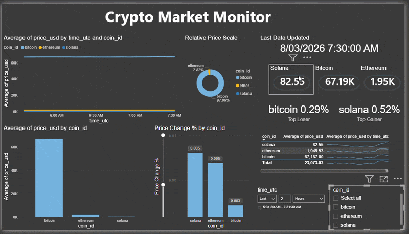
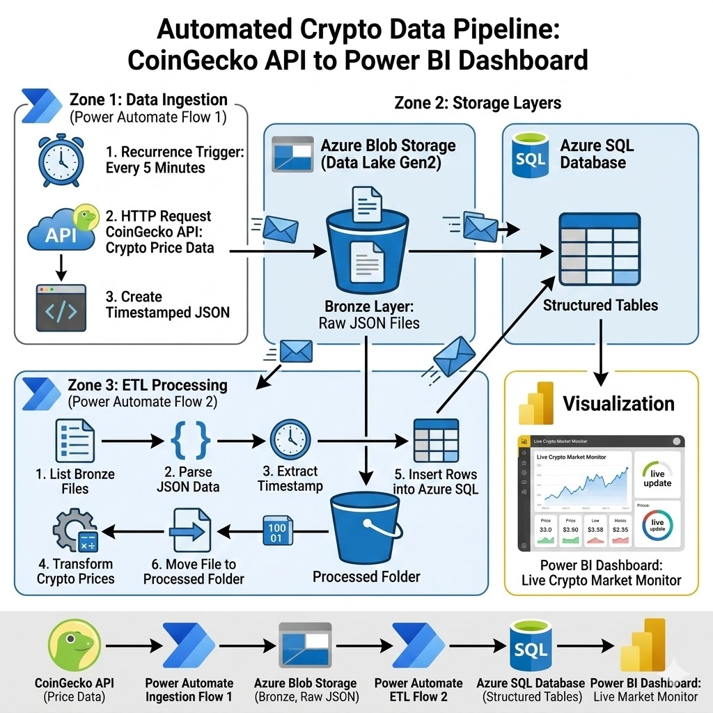

# Real-Time Crypto Data Pipeline Dashboard
### Azure Blob Storage | Power Automate | Azure SQL | Power BI


This project demonstrates an **end-to-end real-time data pipeline** that automates the collection, transformation, and visualization of cryptocurrency market data. By leveraging a **Medallion Architecture (Bronze-to-Silver)**, the system ensures data integrity from raw API ingestion to high-performance BI reporting.

---

## 📊 Dashboard Preview


*The primary dashboard interface focuses on **Price Volatility** and **Market Momentum**. By using a dark-mode UI, the critical KPIs—such as 24-hour highs and current market positions—are emphasized for high-frequency monitoring. The visuals are optimized for DirectQuery to ensure data freshness.*

### Live Dashboard Demo


*The animation above illustrates the **User Experience (UX)** design, featuring cross-filtering capabilities. When a user selects a specific asset (e.g., Bitcoin), all associated time-series charts and trend indicators update instantly to reflect the filtered dataset.*

---

## 🏗️ Architecture Overview



*This architectural diagram highlights the decoupled nature of the pipeline. By separating the **Ingestion Layer (Power Automate)** from the **Storage Layer (Azure SQL)**, the system remains scalable. If the API schema changes, only the 'Bronze-to-Silver' flow requires updating, leaving the historical 'Bronze' data intact.*

---

## 🔄 Pipeline Workflow

```text
CoinGecko API ──> Power Automate (Ingestion) ──> Azure Blob (Bronze/Raw)
                                                        │
                                                        ▼
Power BI <── Azure SQL (Silver/Structured) <── Power Automate (ETL)
```

---

## 1. Ingestion (Flow 1)

This flow acts as the **Data Producer**. It handles authentication and scheduling, ensuring a consistent **5-minute heartbeat of raw JSON data** is delivered to cloud storage.

By landing the data in **Azure Blob Storage** first, we ensure we have a **"Source of Truth"** that can be re-processed if downstream logic ever fails.

---

## 2. ETL Processing (Flow 2)

The **Data Transformer** flow parses nested JSON arrays, converts **Unix timestamps to UTC**, and performs **data cleansing**.

This stage effectively moves the data from the **Bronze layer → Silver layer (Azure SQL Database)**, ensuring that only **high-quality, structured, and typed data** reaches the end-user dashboard.

---

## 🗄️ Database Schema

**File:** `SQL/Create_table.sql`

```sql
CREATE TABLE dbo.fact_crypto_price (
    id INT IDENTITY(1,1) PRIMARY KEY,
    time_utc DATETIME2 NOT NULL,
    coin_id NVARCHAR(50) NOT NULL,
    price_usd FLOAT NOT NULL
);
```

### Example Records

| id   | time_utc            | coin_id  | price_usd |
|------|---------------------|----------|-----------|
| 2450 | 2026-03-08 09:00:00 | bitcoin  | 67530     |
| 2451 | 2026-03-08 09:00:00 | ethereum | 1958.8    |

---

## 📂 Repository Structure
Dashboard/ → .pbix source files for Power BI
Flows/ → Visual logic of the Power Automate sequences
SQL/ → DDL scripts for table creation and optimization
Architecture/ → System design documentation

---

## 💡 Key Learning Outcomes

**Automated ETL**  
Orchestrating cloud workflows without managed servers.

**Medallion Architecture**  
Managing raw (**Bronze**) vs. structured (**Silver**) data states.

**Cloud Integration**  
Connecting disparate SaaS tools such as **CoinGecko, Office 365, and Azure**.

---

## 👤 Author

**Kartik Bhatia**  
[LinkedIn](https://linkedin.com/in/kartik-bhatia-a82718b7)

---

If you found this project useful, feel free to ⭐ **star the repository!**
